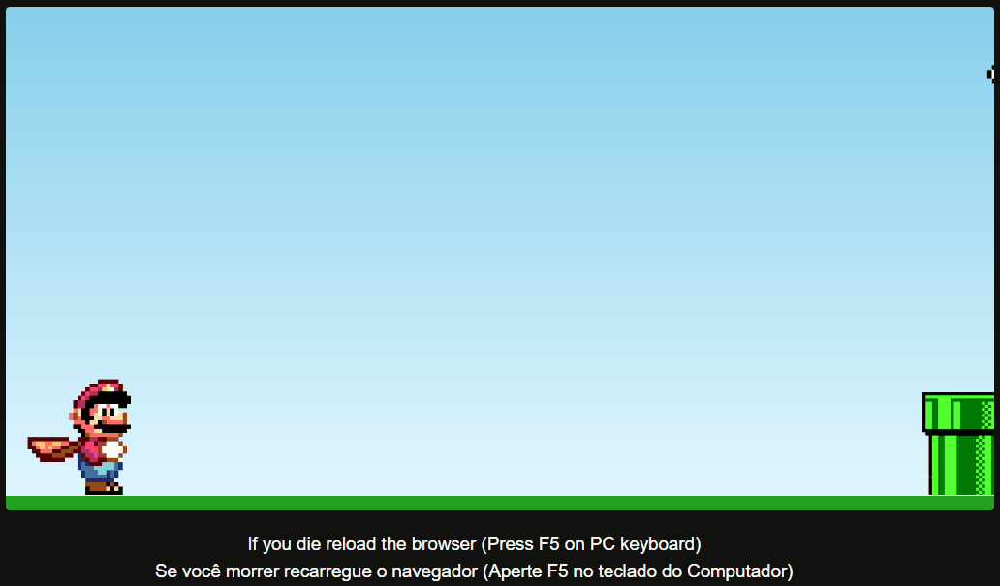

<<<<<<< HEAD

<a href="https://paulopbi.github.io/mario-game/" target="_blank"><strong>Jogo Completo »</strong></a>

Faça o Mario pular os obstaculos em seu caminho.
=======
   
<a href="https://paulopbi.github.io/mario-game/" target="_blank">
<strong>Site Completo »</strong>
</a>

 

Me siga nas redes sociais

>>>>>>> 12a1514ded348c45aa18bb1c5b23c58046e731ef

<a href="https://www.linkedin.com/in/paulopbi/" target="_blank">Linkedin</a> •
<a href="https://github.com/paulopbi" target="_blank">Github</a> •
<a href="https://www.behance.net/paulopbi" target="_blank">Behance</a> •
<a href="https://www.instagram.com/paulopbi_/" target="_blank">Instagram</a>

<<<<<<< HEAD
# Mario Game
=======
 

<h1> Mario Game</h1>
>>>>>>> 12a1514ded348c45aa18bb1c5b23c58046e731ef

## Demo

<<<<<<< HEAD

## Sobre o projeto

Esse projeto foi inspirado no clássico jogo de dinossauro dos navegadores, o objetivo é simples: pular os canos apertando qualquer tecla, se você encostar no cano você irá perder e precisa recarregar a pagina apertando a tecla F5 no teclado.

## Tecnologias utilizadas
=======

## Sobre

Esse projeto foi inspirado no clássico jogo de dinossauro dos navegadores, mas a essa versão é inspirada no mundo dos jogos de Super Mario, o objetivo é simples: pular os canos apertando qualquer tecla, se encostar no cano você morrerá.

### Tecnologias
>>>>>>> 12a1514ded348c45aa18bb1c5b23c58046e731ef

- [x] Html
- [x] CSS
- [x] Javascript

<<<<<<< HEAD
## O que eu aprendi?

- Animações de CSS
- Manipulação de Dom
- Eventos do DOM
- Métodos como "setInterval"
- Conversão de strings para numbers
- Estruturas Condicionais
- Métodos como replace, offset, getcomputedstyle
=======
### O que foi utilizado?

- Animações em CSS.
- Manipulação de Strings e Numbers.
- Eventos do Browser.
- Estruturas Condicionais.
- Manipulação de Dom.
- Métodos como setInterval, replace, offset, getcomputedstyle.
>>>>>>> 12a1514ded348c45aa18bb1c5b23c58046e731ef
- E várias outras coisas.

## Contato

Paulo Victor - paulovictordev16@gmail.com

  

(<a href="#top">Voltar ao inicio</a>)

