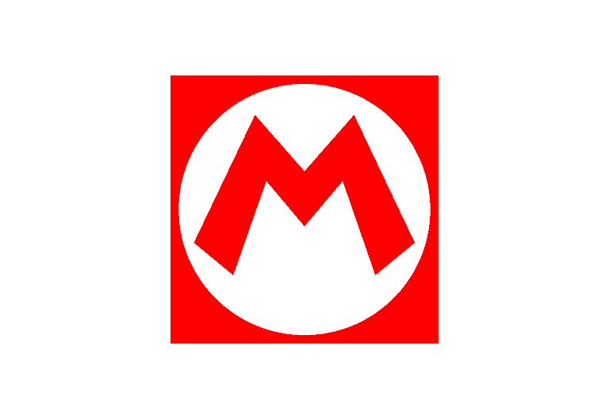

Me Siga nas redes sociais

<a href="https://paulopbi.github.io/mario-game/" target="_blank">Site Completo</a> •
<a href="https://www.linkedin.com/in/paulopbi/" target="_blank">Linkedin</a> •
<a href="https://github.com/paulopbi" target="_blank">Github</a> •
<a href="https://www.behance.net/paulopbi" target="_blank">Behance</a> •
<a href="https://www.instagram.com/paulopbi_/" target="_blank">Instagram</a> 

  

<h1> Mario Game</h1>

## Demo

## Sobre

Esse projeto foi inspirado no clássico jogo de dinossauro dos navegadores, mas a essa versão é inspirada no mundo dos jogos de Super Mario, o objetivo é simples: pular os canos apertando qualquer tecla, se encostar no cano você morrerá.

### Tecnologias

- [CSS](https://developer.mozilla.org/pt-BR/docs/Web/CSS)
- [HTML](https://developer.mozilla.org/pt-BR/docs/Web/HTML)
- [Javascript](https://developer.mozilla.org/pt-BR/docs/Web/JavaScript)

### O que foi utilizado?

- Animações em CSS.
- Manipulação de Strings e Numbers.
- Eventos do Browser.
- Estruturas Condicionais.
- Manipulação de Dom.
- Métodos como setInterval, replace, offset, getcomputedstyle.
- E várias outras coisas.

### Contato

Paulo Victor - paulovictordev16@gmail.com

  

(<a href="#top">Voltar ao inicio</a>)

